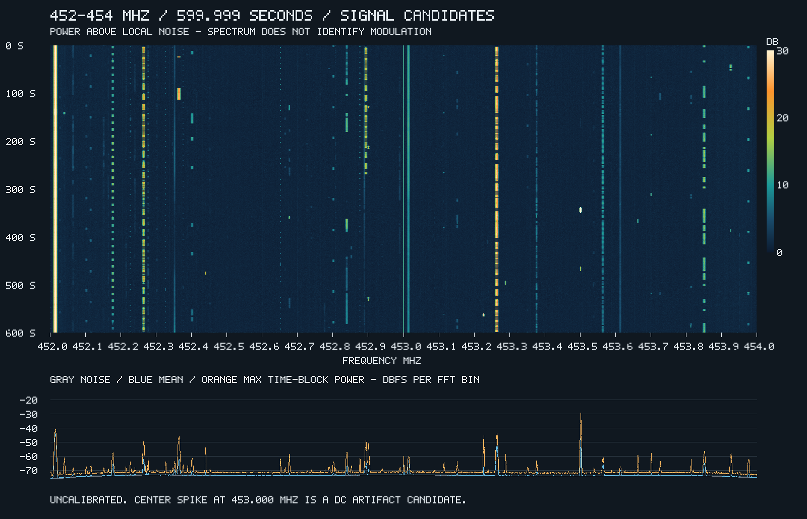

# San Diego: 452–454 MHz survey — September 27, 2026

**Center requested: 453 MHz. Main observation: 10 minutes. 12 frequencies have confirmed DMR evidence; 3 probable FM/Morse signals and 23 unresolved candidates have settings to try.** The feature at exactly 453.000 MHz is a verified receiver DC artifact and is excluded from the signal count.

The RTL-SDR attached to this PC supplied the recordings. These are measured observations, not a frequency-database lookup. San Diego is the requested region label; the antenna, exact receive location, transmitter identities, and licenses were not established.

## How to use the results

- For confirmed channels, select **DMR** in OpenWebRX+. Start with its 12.5 kHz passband and both time slots enabled. Several signals carry control/data or idle frames; successful protocol identification does not imply audible voice.
- **FM** is the browser label for narrowband FM (`nfm`). Recommendations for unresolved channels are trial orders, not modulation identifications. A failed decoder does not prove analog FM.
- Frequencies below are **measured centers**, rounded to 0.0001 MHz. The FFT bin spacing is 585.94 Hz and the receiver was not calibrated. Many features lie about 1.3 kHz above a familiar channel grid; that is an inference, not a calibration. Fine-tune the passband around the received signal. Do not force every feature onto a nominal channel assignment.
- Three probable FM signals carry keyed Morse audio. Use **FM** to hear those identifiers; selecting RF CW mode is not equivalent to demodulating Morse sent over FM.
- DMR color codes are independently verified identification aids. They do not identify an operator or guarantee voice traffic; they need not be entered as an OpenWebRX+ setting.

## Confirmed modulation and decoder

Activity and approximate spectral widths come from the complete ten-minute recording. Activity counts 109 ms analysis blocks with signal energy at least 6 dB above the estimated noise; it is not exact transmitter airtime. Widths depend on signal strength and threshold and are not certified occupied bandwidth.

| Measured MHz | Modulation / decoder | DMR color code | Main activity | Approx. width, kHz |
| ---: | --- | ---: | ---: | ---: |
| 452.0136 | 4FSK / **DMR** | 10 | 100.00% | 12.9 |
| 452.0388 | 4FSK / **DMR** | 2 | 0.67% | 7.0 |
| 452.1765 | 4FSK / **DMR** | 6 | 31.99% | 8.2 |
| 452.2638 | 4FSK / **DMR** | 11 | 23.25% | 10.5 |
| 452.3637 | 4FSK / **DMR** | 3 | 3.80% | 11.1 |
| 452.4009 | 4FSK / **DMR** | 3 | 11.83% | 7.0 |
| 452.8389 | 4FSK / **DMR** | 2 | 29.73% | 7.6 |
| 452.8925 | 4FSK / **DMR** | 12 | 7.25% | 9.4 |
| 453.0138 | 4FSK / **DMR** | 4 | 100.00% | 7.0 |
| 453.2637 | 4FSK / **DMR** | 5 | 30.22% | 11.1 |
| 453.5640 | 4FSK / **DMR** | 1 | 71.29% | 7.0 |
| 453.9765 | 4FSK / **DMR** | 5 | 7.15% | 7.0 |

## Other observed features and settings to try

These features must not be represented as confirmed stations or protocols. “Marginal” means the feature passed the lower detection threshold. The default FM → DMR/NXDN/P25 sequence is exploratory; only the rows with additional evidence have a more specific recommendation.

| Measured MHz | Main activity | Width, kHz | Assessment | Decoder / mode to try | Evidence / limitation |
| ---: | ---: | ---: | --- | --- | --- |
| 452.1015 | 0.36% | 3.5 | Unresolved; marginal | FM first; then DMR, NXDN, P25 | Weak/brief feature; no validated protocol. |
| 452.1138 | 3.09% | 4.7 | Unresolved; marginal | DMR first; then FM / NXDN / P25 | DMR-like timing comb; protocol not confirmed. |
| 452.2263 | 1.29% | 3.5 | Unresolved; marginal | FM first; then DMR, NXDN, P25 | Weak/brief feature; no validated protocol. |
| 452.2761 | 1.88% | 3.5 | Unresolved | FM first; then DMR, NXDN, P25 | Digital voice trials did not validate a protocol. |
| 452.3262 | 2.33% | 2.9 | Unresolved; marginal | FM first; then DMR, NXDN, P25 | Digital voice trials did not validate a protocol. |
| 452.3517 | 18.50% | 4.7 | Unresolved | FM first; then DMR, NXDN, P25 | Detected RF feature; no validated protocol. |
| 452.3757 | 0.29% | 2.3 | Unresolved; marginal | FM first; then DMR, NXDN, P25 | Weak/brief feature; no validated protocol. |
| 452.3886 | 0.05% | 2.3 | Unresolved; marginal | FM first; then DMR, NXDN, P25 | Weak/brief feature; no validated protocol. |
| 452.4390 | 0.87% | 4.7 | Probable: Analog narrowband FM carrying Morse audio | FM (NFM); Morse by ear | A ~799 Hz audio tone is keyed with ~50 ms short and ~150 ms long elements and corresponding ~50/150 ms gaps. This strongly supports Morse over FM, likely an identifier. No stable CTCSS or tested paging protocol was confirmed. |
| 452.6511 | 3.09% | 3.5 | Unresolved | FM first; then DMR, NXDN, P25 | Digital voice trials did not validate a protocol. |
| 452.6763 | 2.69% | 4.7 | Unresolved | FM first; then DMR, NXDN, P25 | Detected RF feature; no validated protocol. |
| 452.8011 | 6.84% | 5.9 | Unresolved | DMR first; then FM / NXDN / P25 | DMR-like timing comb; protocol not confirmed. |
| 452.8761 | 1.69% | 3.5 | Unresolved | FM first; then DMR, NXDN, P25 | Digital voice trials did not validate a protocol. |
| 452.9001 | 2.88% | 8.2 | Unresolved | FM first; then DMR, NXDN, P25 | Digital voice trials did not validate a protocol. |
| 453.1134 | 0.36% | 3.5 | Unresolved; marginal | FM first; then DMR, NXDN, P25 | Weak/brief feature; no validated protocol. |
| 453.1518 | 4.50% | 2.9 | Unresolved; marginal | FM first; then DMR, NXDN, P25 | Digital voice trials did not validate a protocol. |
| 453.2268 | 0.82% | 6.4 | Probable: Analog narrowband FM carrying Morse audio | FM (NFM); Morse by ear | A ~1200 Hz audio tone is keyed with ~45 ms short and ~135 ms long elements and corresponding ~45/135 ms gaps. This strongly supports Morse over FM, likely an identifier. No stable CTCSS or tested paging protocol was confirmed. |
| 453.2886 | 1.22% | 4.7 | Unresolved | FM first; then DMR, NXDN, P25 | Detected RF feature; no validated protocol. |
| 453.3768 | 18.91% | 4.1 | Unresolved | FM first; then DMR, NXDN, P25 | Digital voice trials did not validate a protocol. |
| 453.5013 | 3.55% | 8.2 | Probable: Analog narrowband FM carrying Morse audio | FM (NFM); Morse by ear | A ~1001 Hz audio tone is keyed with ~80 ms short and ~240 ms long elements and corresponding ~80/240 ms gaps. This strongly supports Morse over FM, likely an identifier. No stable CTCSS or tested paging protocol was confirmed. |
| 453.6636 | 1.22% | 4.7 | Unresolved | FM first; then DMR, NXDN, P25 | Detected RF feature; no validated protocol. |
| 453.7011 | 1.67% | 3.5 | Unresolved | FM first; then DMR, NXDN, P25 | Digital voice trials did not validate a protocol. |
| 453.7266 | 0.71% | 2.9 | Unresolved | FM first; then DMR, NXDN, P25 | Detected RF feature; no validated protocol. |
| 453.8142 | 2.68% | 3.5 | Unresolved | FM first; then DMR, NXDN, P25 | Detected RF feature; no validated protocol. |
| 453.8514 | 42.36% | 10.0 | Unresolved | FM first; then DMR, NXDN, P25 | Digital voice trials did not validate a protocol. |
| 453.9261 | 2.51% | 8.2 | Unresolved | FM first; then DMR, NXDN, P25 | Digital voice trials did not validate a protocol. |

## Spectrum and artifact checks



The waterfall uses maximum pooling when reducing time/frequency resolution, so very short bursts remain visible and can look more continuous than they are. The table uses the original analysis blocks. Color is relative power above estimated local noise, not calibrated field strength.

- The original 453.000 MHz spike was present throughout both captures. After tuning the hardware center to 453.100 MHz, the old location fell to at most 2.15 dB above noise and a new spike at 453.100 MHz reached 13.22 dB. This establishes a receiver DC artifact; it is not a transmitter.
- Continuous signals near 452.0137 and 453.0136 MHz stayed at their RF frequencies after the tuning shift. The pairs separated by about 1 MHz also have different activity and/or independently verified DMR color codes, rather than behaving as simple mirrored copies.
- The ten-minute detector initially merged two nearby features around 452.893 and 452.900 MHz. They were split at the spectral valley near 452.896875 MHz after checking their different activity patterns. Their overlap makes measurements less certain than isolated channels.
- The short offset control also showed a feature near 452.0418 MHz. It is not assigned a separate station identity: its relationship to the weak 452.0388 MHz main-capture feature is unresolved.

## Decoder evidence

Each count below comes from one selected trial, not a sum of repeated filter or polarity attempts. Pilot trials used the 60-second recording; main trials used selected active excerpts, not a decoder pass over the full ten minutes. “Valid headers” means all 12 Golay(20,8) parity checks passed on the received DMR slot-type bits **without error correction**, repeatedly giving the listed color code. This confirms protocol structure, not payload CRC, intelligible speech, encryption status, or system ownership.

| Measured MHz | Evidence recording | Exact DMR data syncs | Near syncs (≤3 bit errors) | Valid headers with stated color code |
| ---: | --- | ---: | ---: | ---: |
| 452.0136 | pilot | 1956 | 1997 | 1997 |
| 452.0388 | main | 5 | 26 | 13 |
| 452.1765 | pilot | 7 | 114 | 29 |
| 452.2638 | pilot | 116 | 134 | 133 |
| 452.3637 | main | 312 | 313 | 312 |
| 452.4009 | pilot | 34 | 224 | 95 |
| 452.8389 | main | 124 | 233 | 186 |
| 452.8925 | pilot | 105 | 133 | 127 |
| 453.0138 | pilot | 61 | 511 | 212 |
| 453.2637 | pilot | 275 | 285 | 285 |
| 453.5640 | main | 14 | 86 | 42 |
| 453.9765 | pilot | 6 | 51 | 17 |

Offline digital voice trials covered DMR, P25, YSF, NXDN48, and NXDN96 in both discriminator polarities on selected candidate channels. The strongest pilot DMR signal also had 1,996 pairs of syncs separated by 144 symbols (30 ms). Weaker channels benefited from narrower filters. No credible P25, YSF, or NXDN identification was established. Tiny output buffers or isolated decoder metadata were not accepted as evidence.

Paging/packet trials used FM discriminator audio without speech processing or de-emphasis, converted to 22,050 Hz signed 16-bit samples for POCSAG512/1200/2400, FLEX/FLEX_NEXT, and AFSK1200. POCSAG bit-error correction was disabled. No valid real paging/AFSK messages were found in the tested recordings; a synthetic POCSAG1200 positive control decoded successfully. This negative result does not exclude those protocols elsewhere or during untested intervals.

## Observation record

| Recording | Local command interval (PDT) | IQ duration | Hardware center | Bytes |
| --- | --- | ---: | ---: | ---: |
| Pilot | 2026-09-27 23:38:35–23:39:36 | 60 s | 453.000 MHz | 288,000,000 |
| Main | 2026-09-27 23:40:32–23:50:33 | 600 s | 453.000 MHz | 2,880,000,000 |
| Offset control | 2026-09-27 23:51:03–23:51:14 | 10 s | 453.100 MHz | 48,000,000 |

The command intervals include initialization; hardware timestamps for the first IQ sample were unavailable. UTC dates for all recordings are September 28, 2026. The pilot and main recordings are separate windows with a gap, not one continuous eleven-minute observation.

- Receiver: Nooelec NESDR SMArt v5, RTL2832U / Rafael Micro R820T; device 0.
- Sample rate: 2,400,000 complex samples/s, unsigned 8-bit interleaved I/Q. Main nominal capture span: 451.8–454.2 MHz; analysis restricted to 452–454 MHz.
- Gain: requested 29 dB; tuner reported **29.70 dB**. Frequency correction: **0 ppm**. Antenna and cabling: not specified.
- Each capture exited successfully with its exact requested sample count. Main and pilot ADC endpoint fractions were zero. This does not independently prove absence of front-end overload or USB sample loss.
- The driver logged `[R82XX] PLL not locked!` during initialization before the final tuning message. No later capture failure was reported; the warning is retained in local logs.
- OpenWebRX+ was stopped only for hardware access and restored after capture. Its user service was active and the web page on port 8072 returned HTTP 200 afterward.

## Method and reproducibility

Ten minutes was chosen as a practical initial observation period for intermittent local traffic. The pilot detected 24 spectral candidates; the later main recording detected 38 regions before the nearby pair was split into two. Longer recordings improved coverage here, but a quiet channel is not evidence of non-use. Repeat at different times of day for a regional directory rather than treating this late-evening snapshot as exhaustive.

Detection used 4,096-point Hann-window FFTs, averaging 64 consecutive frames (109.23 ms per block). Noise was estimated from a rolling 150 kHz frequency window using the 30th percentile of time-median spectra, with a per-block median correction. Candidate support required at least two blocks above 4 dB with a peak of at least 6 dB. The stronger category required a peak of at least 10 dB with two active blocks, or a 95th-percentile excess of at least 6 dB. One-bin gaps were bridged; one-bin boundary margins were included in reported widths.

Channel extraction used overlapping one-second FFTs, discarding 250 ms at each end, with globally continuous mixing phase and 48 kHz complex output. Initial pass/stop half-widths were 9/12 kHz; weaker channels were also tested at 5/6.25 and 3.25/4.5 kHz. Digital demodulation followed the installed OpenWebRX+ Digiham chain. The channelizer was checked with a synthetic tone for output length and phase continuity.

Main capture command, run with the receiver device available and the installed SDR environment loaded:

```sh
rtl_sdr -d 0 -f 453000000 -s 2400000 -g 29 -p 0 -n 1440000000 capture-main.cu8
```

Raw recordings, analysis scripts, extracted channels, and trial logs remain locally in the Git-ignored `.build-linux/region-scan-453/` directory. They are not included in this branch. That directory is a build cache and is subject to build-cleaning commands; copy it elsewhere if long-term retention is desired.

The [measurement table](2026-09-27-452-454MHz.csv) accompanies this report. Capture SHA-256 checksums:

| Recording | SHA-256 |
| --- | --- |
| Pilot | `eeb30a43be3077593ad99b8a9c6be0e661eba4eab04a6cc1b959428f176de150` |
| Main | `b07fb16eef515e80dc51107de795278c296020f30d59085d3b35e0a595b05631` |
| Offset control | `126fb5da2aa38414787901c87460554b7c9835db3576c2f3c9f64b61701cc83e` |

Implementation references:

- [OpenWebRX+ mode names and default passbands](https://github.com/aloerch/openwebrx/blob/7a90f6470ddcc266cd90a0ca11999fc8083e73c4/owrx/modes.py).
- [Installed Digiham source revision](https://github.com/luarvique/digiham/tree/beec78229edb8e049f8b82729498def952b79cc1), including DMR slot-type parity checking.
- [RTL-SDR IQ capture implementation](https://github.com/osmocom/rtl-sdr/blob/master/src/rtl_sdr.c).
- [multimon-ng decoder input conventions](https://github.com/EliasOenal/multimon-ng).
