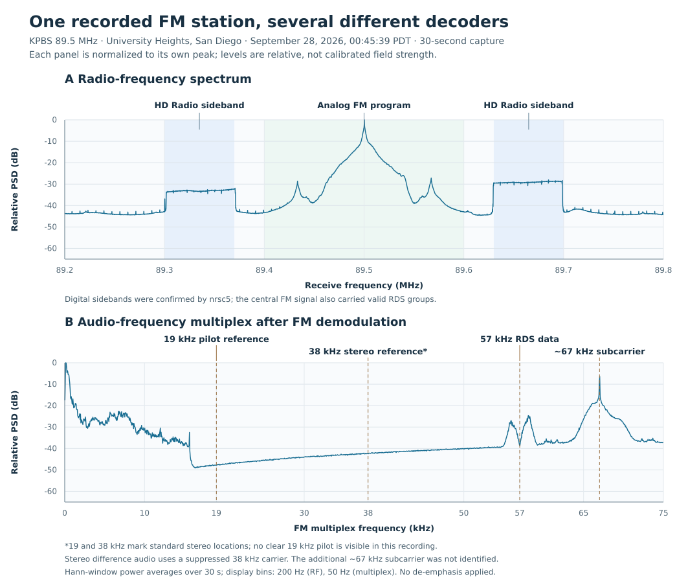

# A radio-decoding learning guide for University Heights

Researched and checked **September 28, 2026**, for a receiver in **University Heights, City of San Diego**, using a **Nooelec NESDR SMArt v5 and a single dipole about 1 m tall**.

Start with **89.5 MHz WFM/RDS/HDR**, then **929.9375 / 929.6125 MHz Page**. Those decoder examples succeeded at this antenna; the first table also provides nearby candidates for other lessons. This guide covers the installed modes, including cases where no suitable local example could be established. A frequency allocation or a repeater directory entry is not proof of reception. **City transmitter**, **received here**, and **regional candidate** are separate claims.

## How to use this guide

- **Decoded here:** supported by the receiver recordings described below. The evidence states exactly what decoded; metadata does not imply intelligible voice.
- **City source:** an operator or official source places the transmitter inside San Diego city limits. Reception in University Heights can still be obstructed.
- **Try:** a documented frequency/protocol, without a successful local decode in this work.
- **Conditional / gap:** scheduled, distant, satellite, or no verified local source. These entries explain the mode without inventing a nearby transmitter.

Frequencies are **MHz**, unless explicitly marked kHz. Repeater frequencies are their **outputs**. For amateur HF digital modes, a **USB dial frequency** is the receiver's suppressed-carrier reference; the tones sit above it. The browser calls narrowband FM **FM**. Select the named decoder as well as the underlying demodulation where the interface offers both. Begin with its preset filter, open squelch for data experiments, and center the whole signal inside the passband.

The live feature check reports dependencies for **69 browser modes** and **three service-only modes**, with **one unavailable mode, TETRA**. **The LoRa family has a confirmed command-line compatibility problem despite its positive feature check**, described below. RDS is an additional WFM feature. An installed dependency establishes decoder availability, not a receivable local station or a fully configured background service. The [complete mode checklist](2026-09-28-university-heights-mode-coverage.csv) records every mode.

## First listening sessions

The listening durations below are recommended starting budgets, not claims that each duration was recorded. Prefer daytime for aircraft, marine working channels, and casual amateur conversations.

| Tune | Select / starting filter | Source and reception status | What to learn; initial listening time |
| --- | --- | --- | --- |
| **89.500** | **WFM**, about 180–200 kHz; enable **RDS** | **Decoded here. City source:** KPBS, Mt Soledad. [KPBS transmitter information](https://www.kpbs.org/news/kpbs/2012/10/04/kpbs-895fm-grows-san-diego-county) | Broad, continuously changing FM spectrum; ordinary broadcast audio. RDS produces PI, station name and text. Actual result: **PI 0x37C8; KPBS.ORG**. Allow 30–60 seconds for text to cycle. |
| **89.500** | **HDR**, approximately 400 kHz total | **Decoded here:** KPBS HD station and service metadata. [KPBS listening options](https://www.kpbs.org/radio/livestream/) | Compare the wide digital sidebands beside the central analog FM signal. Decoder locks, lists services, and can provide digital audio. Actual metadata included **HD1, HD2, HD3**; audio intelligibility was not assessed. Allow 1–2 minutes. |
| **162.425** | **FM**, start 16–25 kHz | **City source / try:** San Diego marine weather, Mt Soledad. [NWS local marine guide, p. 2](https://www.weather.gov/media/sgx/marine/BoatersWeatherBooklet.pdf) | Continuous narrow FM voice is a useful contrast to broadcast WFM. Listen for the spoken station/location and weather cycle. Give it 2–5 minutes. **162.400 MHz is Mt Woodson, outside the City**, and is not substituted here. |
| **126.900** | **AM**, about 8–12 kHz | **City source / try:** Montgomery-Gibbs ATIS. [City airport information](https://www.sandiego.gov/airports/montgomery) | Persistent carrier with symmetric speech sidebands; repeating airport/weather information. Compare AM with FM on the same signal. Allow 2–3 minutes. |
| **119.200**, **125.700** | **AM**, about 8–12 kHz | **City source / try:** Montgomery tower; 125.700 is the published runway-28R daytime frequency. [City airport information](https://www.sandiego.gov/airports/montgomery) | Short voice exchanges and gaps instead of a continuous broadcast. Aircraft may be easier to hear than the ground end. Try 10–15 minutes during airport operating hours. |
| **156.600** | **FM**, about 16 kHz | **City source / try:** channel 12, San Diego harbor control/pilots, Shelter Island. [Port operator instructions](https://www.portofsandiego.org/maritime/mariner-resources/vessel-entry-and-clearance-procedures) | Working-channel voice; moving vessels and ground stations have different strength. Try 10–15 minutes in daytime. Other marine voice examples: **156.800** channel 16 and **157.100** US channel 22A/1022. [USCG channel table](https://www.navcen.uscg.gov/us-vhf-channel-information) |
| **144.390** | **Packet**, FM / preset 12.5 kHz | **Try:** shared APRS channel; users may be mobile or outside City limits. [APRS project](https://www.aprs.org/) | Brief raspy AFSK bursts. Valid packets can yield callsign, path, position, status, weather or messages. A map point requires position content. Listen 10–15 minutes. |
| **131.550** first; **130.025**, **130.450** alternatives | **ACARS**, AM / preset 12 kHz | **Try:** aviation channels, not verified City ground-transmitter sites. [Airframes frequency table](https://app.airframes.io/about/) | Short chirps/bursts, then aircraft registration, flight identifier, message label and sometimes text. Aircraft overhead can be heard from the City. Try 5–10 minutes per active channel. |
| **136.975** first; **136.650**, **136.800** alternatives | **VDL2**, preset 25 kHz | **Try:** aviation VDL Mode 2. [Airframes frequency table](https://app.airframes.io/about/) | Wider digital bursts; decoder can expose link addresses, ground-station information and aircraft data messages. Not ordinary FM speech. Try 5–10 minutes. |
| **161.975**, **162.025** | **AIS**, preset first; widen toward 20–25 kHz if needed | **Try:** AIS channels A/B, vessels in and beyond the bay; no particular City transmitter claimed. [USCG frequencies](https://navcen.uscg.gov/international-vhf-marine-radio-channels-freq) | Short GMSK packets. Depending on message type: MMSI, position, course, speed, vessel name/type. Name and position need not arrive together. [USCG message types](https://www.navcen.uscg.gov/ais-messages) Try 10 minutes on each channel. |
| **1090.000** | **ADSB**, full 2.4 MS/s receiver profile | **Try:** airborne transponders, not a fixed City transmitter | Very short pulse trains, usually dots/streaks at ordinary waterfall speed. Decoder provides aircraft addresses and, when transmitted/decoded, identification, altitude, velocity and position. No intelligible raw audio. **978.000 / UAT** is a separate US aircraft-data system, using about 2.083334 MS/s. [FAA ADS-B explanation](https://www.faa.gov/air_traffic/publications/aim_html/chap4_section_5.html) Try 10 minutes in daytime with a clear view of the sky. |

*Actual 30-second KPBS capture. HD Radio and RDS decoded; RDS reported mono, so the stereo reference markers do not establish stereo reception. Each panel uses its own relative power scale.*

## Digital voice: separate protocol recognition from conversation

The best already-received digital-voice-family lesson is **DMR near 452.0136 MHz, color code 10**, from the [September 27 survey](2026-09-27-452-454MHz.md). Its repeated slot-type headers established DMR; that work did **not** recover intelligible speech or validated message bodies. The frequency is a measured center, not an assertion of a licensed channel or transmitter address. Another observed example is **453.2637 MHz, color code 5**.

| Mode | Frequency and geographic evidence | Learning objective and limitations |
| --- | --- | --- |
| **DMR** | **446.720**, K6RRR, listed as “City”; neighborhood unverified. **449.4625**, AI6DZ, Qualcomm/UTC in the northern City. [San Diego ARES May 2025 plan, pp. 5–6](https://www.sdgares.net/dynamic/library/commplan/files/ARES_Comm_Plan_5-1-2025.pdf) | Preset 12.5 kHz; four-level FSK, two time slots. Plan lists CC1 for K6RRR, CC6 for AI6DZ. Look for stable color code, slot activity and IDs; clear voice requires actual voice traffic. Published ARES net: Thursday 19:50 local, subject to rechecking. Monitor 15–30 minutes or a scheduled net. |
| **P25** | **447.280**, KI6KHB, Mt Soledad, **City source / try**. Owner's 2018 notice lists mixed P25/FM, NAC858 and FM PL91.5. [SBE owner notice](https://sbe36.org/2018/06/sbe-chapter-36-ham-repeater-updated/) | Preset 12.5 kHz; select P25 during digital traffic, FM during analog traffic. Learn NAC and source/talkgroup fields when valid. The old listing does not prove current activity. Monitor 15–30 minutes. This installed path is **Phase 1 C4FM**; it does not automatically follow trunked conversations or provide Phase 2 decoding. |
| **YSF / C4FM** | **447.320**, WB6WLV Kearny Mesa: owner confirms **FM**, but no primary confirmation of YSF operation was found. [SANDRA owner listing](https://www.sandra.radio/) | A good **City FM candidate**, with PL107.2. Try YSF only if there is digital activity; do not count this as a confirmed Fusion example. YSF can expose callsigns and voice/data mode. |
| **D-Star** | **No verified City example found.** Optional outside-City trial: **447.845**, KI6KQU / PAPA D15, **Mt Woodson**. [PAPA sites](https://papasys.com/papa-repeaters/d-star/), [gateway frequency record](https://www.dstarusers.org/viewrepeater.php?system=KI6KQU) | Roughly 6.5 kHz preset, GMSK; callsign/routing fields, short text and clear voice when active. Woodson is explicitly an out-of-City fallback, with no reception guarantee. |
| **NXDN** | **No suitable City frequency verified.** | Narrow four-level FSK; source/destination IDs and clear voice if supported. This checkout uses the **NXDN48** path (2400 symbols/s), not a verified NXDN96 path. A narrow trace or one sync match does not establish NXDN. |
| **M17** | **No suitable City frequency verified.** | Digital voice with Codec2; expect source/destination callsigns and voice on valid transmissions. Use a known operator's recording or arranged demonstration. |
| **TETRA** | **Unavailable here:** missing `tetrarx`; no City learning source verified. | Not currently a usable browser lesson on this installation. A menu definition alone is not installed support. |

A digital signal can carry control or data continuously while producing no voice. Encryption, missing traffic, an incompatible phase, or unsupported voice format can also leave audio silent. The local P25 decoder does not validate every metadata field; isolated displayed IDs are weak evidence. Capability details come from this checkout's [digital-voice chain](../../csdr/chain/digiham.py) and [mode definitions](../../owrx/modes.py).

## Broadcast, tone signaling and general audio modes

| Mode | Local exercise or honest gap | Appearance, sound and output |
| --- | --- | --- |
| **AM / SAM** | **1.130 MHz (1130 kHz), KSDO**, 52nd Street City transmitter; try both demodulators on the same station. **Q direct sampling is required.** [Local broadcast engineers' August 2026 site report](https://sbe36.org/2026/08/52nd-street-site-getting-a-new-master-antenna/), [station operator](https://www.radioinspiracion.com/con%C3%B3cenos) | Carrier and two sidebands, ordinary speech/music. SAM uses synchronous carrier recovery and may behave differently during fading/interference. Start with 8–10 kHz total width, 2 minutes. The one-meter dipole is a significant MF limitation. |
| **EAS** | **162.425**, only when the weather station sends a **SAME test/alert header**; ordinary forecast voice is not EAS data. | Brief harsh AFSK bursts; decoder can show originator, event, affected area codes, duration and time. Routine tests are generally Wednesday 10:00–noon local, weather permitting; verify this station's announcement. [NWS test information](https://www.weather.gov/dsb/nwrtest) Wait through the announced test window, not an arbitrary minute. |
| **Page** | **Decoded here: FLEX near 929.9375 and 929.6125** nominal channels. Measured centers were approximately **929.9400 / 929.6156** with this receiver; center the actual trace. **929.6625** is an additional candidate. Transmitter sites are **not established as City sites**. [Provider frequency list](https://pagersdirect.net/pages/faqs) | Select Page / FM, start 20–25 kHz, then narrow if useful. Repetitive four-level FSK bursts decoded as **FLEX 3200 baud / 6400 bit/s**. Output included frame/phase and message-type records; private addresses/text are omitted. This demonstrates FLEX; it does **not** establish a working local POCSAG example. Try 5–10 minutes. |
| **SelCall / Zvei** | **No verified City frequency carrying these particular tone codes found.** | Short ordered audio-tone sequences on FM; output is a tone/address sequence, not a transcript of the following speech. CTCSS, DCS and a Morse station ID are different signals. Use a correctly identified sample. |
| **Speech Transcriber** | Try clear public weather speech on **162.425**, or AM ATIS on **126.900**, with the appropriate underlying mode. | Speech-to-text after demodulation, not an RF modulation or error-checked data protocol. Noise, clipped words, callsigns and numbers can be mistranscribed. Availability was reported by the server; transcription itself was not validated here. |
| **DATA** | General wide USB/data output, **not a separate transmission type with its own local frequency**. | Useful for inspecting/exporting a wider audio/data passband; choosing DATA alone does not identify or decode a protocol. |
| **DAB** | **No local DAB ensemble verified.** | Broad, roughly 1.5 MHz OFDM ensemble; services, audio and labels if a compatible broadcast exists. KPBS's digital companion is **HDR/HD Radio**, not DAB. A European DAB channel list is not a San Diego frequency guide. |
| **DRM** | **No City DRM station or reliable dipole-based live example verified.** | Typically a rectangular HF digital block; station/service information and audio after lock. Consult the [DRM consortium's current schedules](https://www.drm.org/drm-shortwave-broadcast-summer-schedule/) for a distant HF experiment. DRM, DAB and HD Radio are different systems. |

## Sensors, LoRa and mesh packets

**Current LoRa software blocker:** the running service resolves to the installed `lorarx` tested here, which rejects `-j` even though its help advertises that option. The browser chain requires `-j` for JSON output and also uses newer argument syntax. Consequently, LoRa WAN/APRS/FANET, Meshtastic, Meshcore and MeshCom are **frequency research candidates, not ready-to-use browser lessons on this installation** until decoder compatibility is repaired. A standalone trial using accepted options completed on the two Meshtastic settings but decoded no CRC-accepted frames in 120 seconds. No software or decoder settings were changed.

These are good learning opportunities only when a compatible transmitter is nearby. A regional community or channel plan does not establish coverage at this antenna. A LoRa waterfall commonly shows repeated diagonal chirps when zoomed sufficiently; most packet modes sound like noise or brief clicks under an ordinary audio demodulator.

| Mode | Frequency/settings to try | What the decoder can teach; evidence boundary |
| --- | --- | --- |
| **ISM** | **433.920** first; other devices may use 315, 345 or channels in the 915 MHz band. | Short OOK/FSK packets; supported sensors can yield model, device ID, temperature, humidity or other telemetry. Use an owned compatible sensor for a predictable exercise. No particular nearby sensor is assumed. [rtl_433 supported devices and bands](https://github.com/merbanan/rtl_433) Listen 10–15 minutes or trigger a known device. |
| **Meshtastic** | **908.750**, LongTurbo, **500 kHz / SF11 / CR4/8**; also **906.875**, LongFast, **250 kHz / SF11 / CR4/5**. | The [current SoCal Mesh homepage](https://socalmesh.org/) recommends the first; older regional advice and the [official default settings](https://meshtastic.org/docs/overview/radio-settings/) support the second. **Regional candidates**, not established City transmitter sites. Expect node/packet metadata; readable messages depend on channel configuration and keys. Monitor each for 15–30 minutes. |
| **Meshcore** | **927.875**, **62.5 kHz / SF7 / CR4/5** | Settings documented by the [TWEM operator](https://www.privatetier.solutions/twem/), based in **Temecula, outside the City**. A regional trial, not a promised local source. The installed generic LoRa parser may show packet data rather than a fully interpreted chat interface. |
| **LoRa WAN** | Use a known network's **US915 channel plan**; no single universal 915.000 MHz channel. | Chirp modulation plus LoRaWAN frame structure; addresses/frame counters may decode while application data remains encrypted. No University Heights source/channel was verified. [Semtech US915 implementation](https://github.com/Lora-net/LoRaMac-node/blob/master/src/mac/region/RegionUS915.h) |
| **LoRa APRS** | **No City node/channel verified.** | Different waveform from conventional 144.390 MHz AX.25/APRS. Use an identified LoRa APRS node's actual settings or a recording. |
| **LoRa FANET** | Nominal US plan **920.800**, **500 kHz**; no City-equipped pilot verified. [Protocol author's specification](https://github.com/3s1d/fanet-stm32/blob/master/Src/fanet/radio/protocol.txt) | Air-sport tracking packets. **Compatibility caveat:** this checkout's FANET chain fixes bandwidth to 250 kHz, so the nominal US500 kHz example is not a ready-to-use match. |
| **MeshCom** | **No City node/channel verified.** | Mesh packet/position data; the [project's European deployments](https://wiki.oevsv.at/wiki/MeshCom) do not justify assigning their channels to San Diego. |
| **WMBus** | **No City compatible meter/transmitter verified.** | Telegram IDs and, where supported and accessible, meter values. US meters are not automatically Wireless M-Bus; European 868.3/868.95 MHz defaults are not established local targets. [wmbusmeters project and sample telegrams](https://github.com/wmbusmeters/wmbusmeters) |

For Meshtastic, the administrator's **Decoding → LoRa messages → Meshtastic bandwidth** must match the channel: option **250** for LongFast or **500** for LongTurbo. This checkout labels those choices “kbps,” but they select **RF bandwidth in kHz**, not payload bit rate. The installed chain tries SF7–SF11. Bandwidth, frequency, waveform and packet validity all matter. Settings were inspected, not changed. See [bandwidth controls](../../owrx/form/input/__init__.py) and [LoRa chains](../../csdr/chain/lora.py).

## Weather balloons and scheduled satellite lessons

| Mode | Target / scope | What to look for and decode |
| --- | --- | --- |
| **Sonde RS41** | **Miramar/KNKX, within the City**, is an official RS41 launch source. **Search 400.15–406 MHz** for the actual flight; “403 MHz” in the station notice describes the radio family, not a verified fixed channel. [NWS station notice](https://www.weather.gov/media/notification/pdf2/scn20-12radiosonde_san_diego_aaa.pdf), [Vaisala frequency range](https://docs.vaisala.com/v/u/B211321EN-L/en-US) | Repetitive narrow FSK telemetry. Valid frames can yield sonde serial, GPS position, altitude, motion and weather fields, depending on what the parser supports. Nominal observations are **00/12 UTC** (5 pm/5 am PDT); launch can precede them. [NWS upper-air program](https://www.weather.gov/upperair/) Monitor around a verified launch and follow the moving balloon. |
| **Sonde DFM9 / DFM17 / MTS01 / M10 / M20** | **No City launch/channel verified for these models.** | Each needs its matching waveform/parser. The local RS41 source does not supply examples for the other five. Start with model-specific recordings. |
| **SSTV** | Upcoming **ISS 437.550 MHz, Robot36**, October 2–6, 2026; **satellite**, not City ground transmitter. | Select **FM plus SSTV**, start around 15–20 kHz and track Doppler. Sweeping/warbling audio draws a picture line by line. Event runs **Oct 2 02:00 PDT–Oct 6 08:55 PDT**, 36-second images separated by two-minute gaps. Listen during a predicted local pass. Recheck the [official event announcement](https://www.ariss.org/upcoming-sstv-events.html) before use. |
| **Packet, satellite alternative** | Current ARISS test frequency **437.825**; voice-repeater downlink **437.800** is a different exercise. | Pass-dependent, no reception claim. The [September 25 ARISS status](https://www.ariss.org/current-status-of-iss-stations.html) supersedes older blanket advice to use 145.825 for packet or 145.800 for this SSTV event. |

The ordinary 1 m dipole may receive a favorable overhead pass, but antenna orientation, sky obstruction and Doppler matter. A quiet channel between passes says nothing about decoder correctness.

## Conditional HF lessons

The **v5 does support 0.1–25 MHz using Q-branch direct sampling**; tuner reception covers approximately 25–1750 MHz. An upconverter is not intrinsically required for this model. [Nooelec v5 FAQ](https://support.nooelec.com/hc/en-us/articles/10470422657047-NESDR-SMArt-v5-FAQ) Select an appropriate direct-sampling receiver profile for these entries. The one-meter dipole is electrically short at HF/MF, so these are less dependable than the VHF/UHF lessons. **None of the following is claimed to be a City transmitter.**

Use USB and the decoder preset unless the row says otherwise. A narrow digital signal belongs inside the audio passband; clicking its RF center as though it were an FM channel can mistune it. For secondary decoders, place the secondary selector on the actual trace. Keep the computer clock synchronized for the timed weak-signal modes.

| Mode | Frequency / starting exercise | Appearance, sound, decoded information and useful dwell |
| --- | --- | --- |
| **USB** | **8.764 USB**, NMC/Point Reyes scheduled weather voice, e.g. 04:30/10:30/16:30/22:30 UTC. [NWS/USCG voice schedule](https://www.weather.gov/marine/uscg_broadcasts) | Speech sideband without a large carrier; wrong sideband/offset sounds distorted. Listen through a scheduled bulletin, propagation permitting. |
| **LSB** | Find an active amateur voice signal in **7.175–7.300**, LSB; no particular station guaranteed. [ARRL allocations](https://www.arrl.org/frequency-allocations) | Voice energy below the suppressed carrier. Allow 10 minutes searching; use about 2.7–3 kHz audio width. |
| **CW / CW Decoder / CW Skimmer** | **14.100 RF**, NCDXF/IARU beacon network. [Operator schedule](https://www.ncdxf.org/beacon/index.html) | Thin keyed trace; dots/dashes with callsigns and stepped-power tones. Set a useful CW pitch; decoder extracts text, skimmer can follow several traces. A network cycle takes **3 minutes**. An FM repeater's audible Morse ID is not RF CW. |
| **BPSK31** | **14.070 USB**, then select a narrow active trace. [Operator guide](https://ham.aditl.com/ham-radio/digital-modes/psk31-quick-guide/), [ARRL protocol](https://www.arrl.org/psk31-spec) | Very narrow trace, warbling idle tone; conversational text when decoded. Try 10–15 minutes when the band is open. |
| **BPSK63** | **No verified local or reliably active example found.** | Similar appearance at a faster symbol rate; use a known BPSK63 recording. PSK31 activity does not validate this decoder. |
| **RTTY-170 (45) / RTTY Skimmer** | Search the **14.070–14.095** amateur data region for actual RTTY. [ARRL band plan](https://www.arrl.org/band-plan) | Two tones 170 Hz apart, approximately 45.45 baud; alternating “diddle” sound and text. A contest can improve activity. Skimmer finds multiple signals; not everything in that frequency span is RTTY. |
| **RTTY-450 (50N) / RTTY-85 (50N)** | **No City transmitter verified for either variant.** | Match respectively 450/85 Hz shift, 50 baud and polarity. Use correctly identified samples rather than selecting these on ordinary amateur RTTY. |
| **SITOR-B / NAVTEX** | **0.518 RF center**, Cambria identifier Q, a **distant coastal** service. [USCG NAVTEX description](https://www.navcen.uscg.gov/navtex-maritime-safety-broadcasts), [NWS station/products](https://www.weather.gov/marine/navprod) | 100-baud, 170 Hz-shift FSK; decoded maritime/weather text. NAVTEX adds message framing/interpretation to the SITOR-B family. For example, tune **0.516500 USB** and place the secondary selector at **+1500 Hz**, yielding **0.518000 RF**; center it on the actual two-tone signal. Wait for the station's published slot. MF antenna limitations are substantial. |
| **DSC** | **8.4145 RF center**, MF/HF maritime calling candidate. [USCG handbook](https://www.navcen.uscg.gov/sites/default/files/pdf/navRules/Handbook/Nav%20Rules%20Handbook_Corrected_08-12-2024.pdf) | Structured FSK calling bursts; identities, category and position when included. This is the installed **MF/HF 100-baud, 170-Hz-shift path**, not the different VHF channel-70 waveform. Example: **8.413000 USB +1500 Hz** on the secondary selector gives **8.414500 RF**; traffic is intermittent. |
| **FT8** | **14.074 USB** daytime candidate; **7.074 USB** alternative. | Narrow multi-tone lanes in synchronized 15-second periods; callsigns, grids and signal reports. Start with 5 minutes. |
| **FT4** | **14.080 USB** | Faster timed contacts, 7.5-second periods. Callsigns/reports; start with 5 minutes. |
| **JT65** | **14.076 USB**, conventional candidate, current occupancy unverified. | Many narrow tones, one-minute periods; callsigns/grids/reports. Give it 5–10 minutes if active. |
| **JT9** | **14.078 USB**, conventional candidate, current occupancy unverified. | Narrow timed multi-tone transmissions, usually one-minute periods; frequency overlaps other uses, including JS8. |
| **WSPR** | **14.0956 USB dial**; RF energy near **14.0971** | Extremely narrow beacon traces; callsign, grid and reported transmit power. Use **10–20 minutes**, covering several two-minute cycles. [Manufacturer's tuning example](https://www.qrp-labs.com/images/qdx/manual_operation_1_03.pdf) |
| **FST4 / FST4W** | **No verified City/live channel supplied.** Start with project samples. | Narrow weak-signal contacts/beacons with long selectable periods. FST4W includes 120/300/900/1800-second sequences; a one-minute scan can miss a complete frame. |
| **Q65** | **No verified City station/scheduled lesson found.** | Weak-signal scatter/EME mode; match submode and period. A sample recording is a more dependable first lesson with this antenna. [Protocol authors' guide](https://wsjt.sourceforge.io/Q65_Quick_Start.pdf) |
| **MSK144** | **50.260 USB**, or **28.145 USB** during the documented 2026 meteor-scatter activity. [HamSCI operator guide](https://www.hamsci.org/msqp-how) | Brief scatter “pings,” decoded callsigns/reports. Conditional propagation and antenna requirements; observe a scheduled activity period rather than a one-minute sweep. |
| **JS8Call** | **14.078 USB** | FT8-related narrow multi-tone bursts carrying more flexible text/heartbeat messages. Select JS8Call, not JT9 based on frequency alone. [Project guide](https://js8call.com/JS8Call-improved/d6/d14/md_docs_2user__guide_2JS8Call__User__Guide.html) Try 10–15 minutes. |
| **FreeDV / RADEU / RADEL** | **14.236 USB** calling candidate for FreeDV/RADEU; **7.177 LSB** for RADEL, only when a matching transmission is active. [FreeDV project](https://freedv.org/), [project-linked activity reporter](https://freedv-reporter.k6aq.net/) | Digital noise becomes speech after a compatible decoder locks. FreeDV and RADE are not interchangeable waveform labels. Check activity/mode first; no City operator or local reception is claimed. |
| **HFDL** | San Francisco network examples **10.081**, **8.927**, **6.559 USB**; active channels change with propagation. [Airframes station table](https://app.airframes.io/about/) | Bursty aircraft HF data; ground-station/link information and aircraft messages. Distant source, not a San Diego airband channel. Try 10 minutes on an active frequency. |
| **Fax** | Point Reyes **8.682 RF**, tune **8.6801 USB**; alternative **12.7841 USB** for 12.786 RF. [NWS radiofax schedule and 1.9 kHz offset](https://ocean.weather.gov/shtml/pacsch.php) | Rhythmic fax tones build weather charts line by line. Start with 120 lines/minute, IOC576; capture a complete scheduled chart, often 10–15 minutes. |

The FT/JT dial examples and timed-mode/sample workflows are documented in the [WSJT-X user guide](https://wsjt.sourceforge.io/wsjtx-main_en.html) and [frequency table](https://wsjt.sourceforge.io/wsjtx-doc/wsjtx-main-2.6.1.pdf). These conventional frequencies are experiments, not promises of current activity. Project WAV samples can be used with the corresponding standalone decoder; this guide does not assume the browser provides arbitrary file upload/replay.

## Service-only modes

| Service | Practical learning path |
| --- | --- |
| **Audio Recorder** | Record a correctly demodulated AM/FM/SSB/CW example through the configured background service. This is recording, not another over-air format. Service scheduling/configuration is required. |
| **Meteor-M2 LRPT** | Satellite-pass exercise: nominal **137.100 / 137.900** candidates, not verified current transmissions. Check the specific satellite, pass, symbol rate and operational status first. Sources disagree on current activity. [Firsthand receiver guide](https://www.a-centauri.com/articoli/meteor-satellite-reception), [SatDump pipelines](https://docs.satdump.org/md_docs_2pages_2Pipelines.html), [observer status](https://ub8qbd.satdump.org/wx_report_new.html). Output is satellite imagery after a suitable pass recording. |
| **Elektro-L LRIT** | **No practical University Heights example verified with this dipole.** Nominal 1691 MHz being within tuning range does not establish a visible satellite or adequate antenna/system. Do not substitute a GOES transmission for an Elektro decoder. |

Old NOAA APT tutorials are not a current live alternative: **NOAA 15, 18 and 19 were decommissioned in 2025**. [NOAA retirement notice](https://www.nesdis.noaa.gov/news/legacy-orbit-noaa-decommissions-the-poes-satellite-constellation) Archived recordings remain useful lessons.

## What was actually checked

The receiver recorded **14.5 minutes of valid IQ in two batches**, during **00:45:39–01:01:55 PDT on September 28** (07:45:39–08:01:55 UTC), with a gap between batches. These were targeted overnight snapshots, not a full-band census or the recommended listening budgets above. **OpenWebRX+ was restored after each batch; final checks returned service `active` and HTTP 200.**

| Recording / tested target | Actual duration | Outcome and boundary |
| --- | ---: | --- |
| 89.500 WFM/RDS | 30 s | **338 complete RDS groups with error correction disabled**, plus one partial group. Stable **PI 0x37C8**, callsign KPBS, program-service name **KPBS.ORG**; RadioText and clock fields also appeared. RDS reported mono. |
| 89.500 HDR, same recording | 30 s, shared | **HD Radio synchronized; KPBS, facility 58823, HD1/HD2/HD3 listings**, and program metadata **BBC World Service**. Decoder reported audio output bitrate; audio was discarded, so intelligibility and all three audio services were not assessed. |
| Page, nominal 929.9375 | 60 s, shared paging band | **FLEX 3200 baud, four levels (6400 bit/s)** near measured **929.93994**. 12 recognized records: 11 alphanumeric, one numeric; four additional unknown-type records excluded from that count. Benign example: **cycle 14 / frame 77 / phase A**. |
| Page, nominal 929.6125 | Same 60 s | **FLEX** near measured **929.61563**. 34 recognized records: 28 alphanumeric, four numeric, two tone-only; two unknown-type records excluded. These are decoder records, not counts of people, transmitters or unique messages. |
| 162.425 weather; AIS 161.975/162.025 | 90 s, shared band | No strong continuous weather signal established by the RF check; **zero CRC-valid AIS packets**, including a narrower-filter retry. City weather-source documentation remains useful, but reception is not confirmed here. |
| ADSB 1090.000 | 60 s | **Zero accepted frames** with bit correction disabled; all 144 million samples processed. This overnight test does not promise daytime coverage. |
| ACARS 131.550/130.025/130.450 | 90 s, shared band | **Zero messages** on these three channels. |
| VDL2 136.975/136.650/136.800 | 90 s, shared band | **Zero messages** with the correct 2.1 MS/s offline decoder input. |
| Packet/APRS 144.390 | 90 s | **Zero CRC-valid AX.25 frames** with bit repair disabled. A synthetic FM/AFSK control passed four frames through the same demodulation path. |
| 446.720 DMR; 447.280 P25; 447.320 FM/YSF | 60 s, shared band | No clear on-channel activity or corroborated digital decode. A lone NXDN-like annotation failed supporting checks and was rejected. This does not establish repeater operating status. |
| FT8 7.074 USB, Q direct sampling | 90 s | **Zero FT8 decodes** across UTC-aligned windows and startup-offset trials. A bundled WSJT-X sample decoded 20 messages as a control. Short dipole/HF reception remains conditional. |
| 1.130 AM, Q direct sampling | 30 s | Recorded as a hardware-path experiment; no station-identification or audio-intelligibility validation. KSDO remains a source-backed candidate. |
| Meshtastic 906.875 / 908.750 | 120 s, shared band | No CRC-accepted LoRa frames from the documented SF11 / 250 or 500 kHz configurations using a compatible standalone command. Browser chain compatibility is a separate known blocker. |
| ISM 433.920 | 60 s | **Zero decoded events** using the installed `rtl_433` default protocols. No local device was known to be transmitting during the test. |

FLEX integrity is narrower than “all text verified”: the installed decoder accepts its sync/mode patterns with limited bit differences, checks the frame-information word using **BCH(31,21), up to two corrected bits**, plus a **four-bit checksum**, and requires BCH acceptance of all 88 words in a decoded phase. It does **not** establish an end-to-end alphanumeric payload checksum or complete fragment reassembly. POCSAG bit-repair settings do not disable FLEX correction. The two repeated, structured FLEX results establish the protocol; **addresses and message bodies are omitted**. No successful POCSAG example was established, including the bounded additional paging-channel trials.

The receiver used unsigned 8-bit IQ, manual requested gain 29 dB (**29.7 dB selected** on the tuner), **0 ppm correction**, and 2.4 MS/s except VDL2 at 2.1 MS/s and ISM at 250 kS/s. MF/HF used Q direct sampling; tuner gain is not an equivalent gain control in that path. Paging centers were estimated from occupied spectra and differ from nominal channels by a few kHz: this is not a frequency calibration or a transmitter-license identification. An invalid initial recording caused by a CLI-option mismatch was discarded before these valid batches.

[Capture manifest and concise evidence](2026-09-28-university-heights-evidence.json) preserve UTC intervals, sample counts and SHA-256 hashes without message payloads. Local IQ, scripts and detailed decoder logs remain under the ignored `.build-linux/learning-guide/` directory. Receiver measurements and installed-code inspection supplement the linked operator/official sources; neither research nor a short negative recording establishes that a signal is absent from the City.

## Recognizing progress

For each exercise, save the tuned frequency, mode, filter width, local time, waterfall screenshot and one clearly identified decoder field. First establish a repeatable signal; then distinguish **frame/header detection**, **validated metadata**, **readable message/image**, and **intelligible voice**. These are different achievements.

A useful stopping rule is: after the suggested dwell with no repeatable signal, move to another proven example or revisit during known activity. A continuous broadcast needs seconds; intermittent packets and repeaters need minutes; scheduled broadcasts and satellites need the right time. More dwell cannot repair an incompatible decoder, missing antenna coverage, or a transmitter below the horizon.
